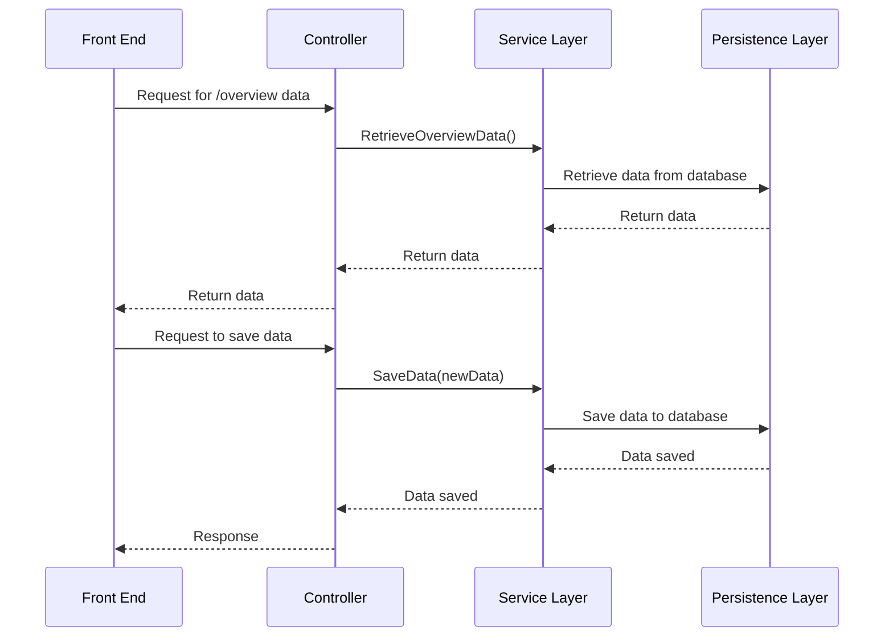

# API

The api has a controller taking in requests for data. The controller asks the service layer to give it what's needed. The service layer asks the persistence layer for the data after which it transforms it into the format that the controller expects and then returns it. The persistence layer is responsible for representing the state of the database in c# code. The api thus has a get request for getting the overview data and a post request for saving new records.

