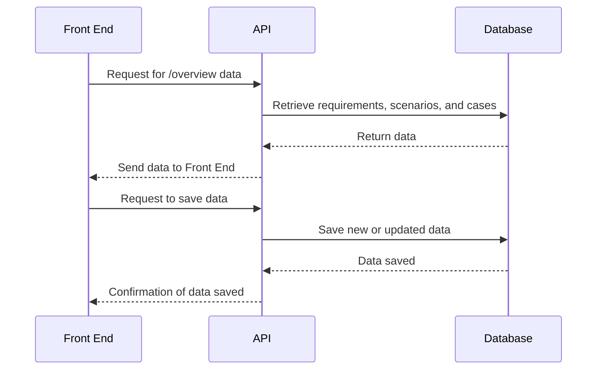

# Architecture

I want a [front-end](./front-end.md), [api](./api.md) and [database](./erd.md). 

At this time I don't know what I want to show on the front end so I'm going to start from the data model and work upwards.

