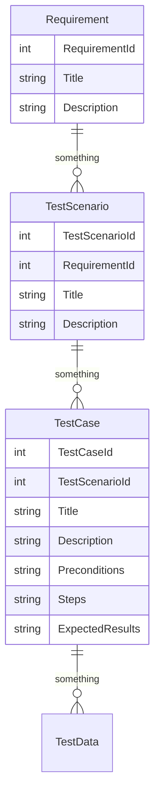

# Entity Relationship Diagram

I want to keep state. At a basic level I want something to serve on the UI that states what form of data the system is willing to accept from the user.

This is a test management system. There are requirements. There are test scenarios that test the requirement. Ideally you would have a one-to-many association between a requirement and test scenarios of that. e.g. The user can pay can be satisfied with the scenario of paying by cash or credit or a voucher or a combination of them. However another requirement may occur. I'm not quite clear on how this complication would come up at this time. 

Test scenarios are groupings of test cases. A test case can focus on input validation e.g. special characters, boundaries, equivalent partitions. Again this can be looking at inputs on the entered amount.

How the validations are implemented in the various layers outside the database are just outside the scope.

For the moment, a requirement as one or many test scenarios each of which has one or many test cases.

